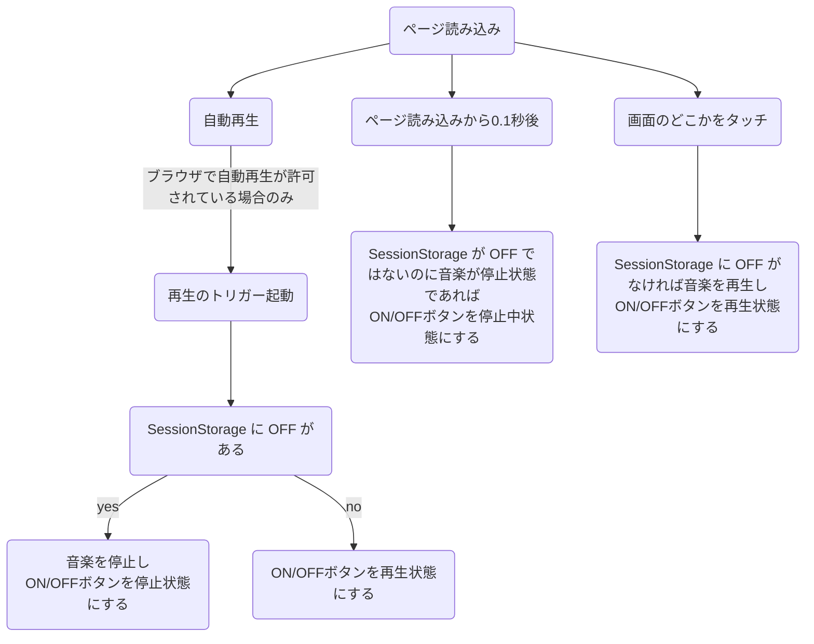

```mermaid
flowchart
    id0("ページ読み込み")
    id1("自動再生")
    id2("再生のトリガー起動")
    id3("SessionStorage に OFF がある")
    id4("音楽を停止し<br>ON/OFFボタンを停止状態にする")
    id5("ON/OFFボタンを再生状態にする")
    id6("ページ読み込みから0.1秒後")
    id7("SessionStorage が OFF ではないのに音楽が停止状態であれば<br>ON/OFFボタンを停止中状態にする")
    id8("画面のどこかをタッチ")
    id9("SessionStorage に OFF がなければ音楽を再生し<br>ON/OFFボタンを再生状態にする")
    
    id0 --> id1
    id1 -- ブラウザで自動再生が許可されている場合のみ --> id2
    id2 --> id3
    id3 -- yes --> id4
    id3 -- no --> id5
    
    id0 --> id8
    id8 --> id9
    
    id0 --> id6
    id6 --> id7
```
